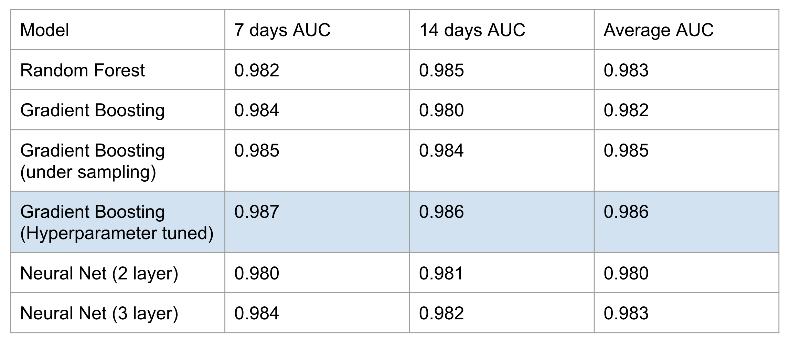

# Predicting mobile app purchases
<i> Team Memebers: Hongdou Li, Jacques Sham, Katja Wittfoth </i>
 
 
Final project for Advances Machine Learning class at University of San Francisco.

We were given a data set from the industry partner with a goal is to predict user churn. Since it is usually too late for a company if a user is churned, identifying churn is not a straight forward problem to solve. Therefore, the task of this project was to recognize the early signs of churn by predicting whether a user is going to make a purchase within the next 7 and 14 days. The prediction is a binary classification which measures if there will be a purchase or a lack of it. We will be evaluating our models with AUC.

## Dataset
The data describes attributes, session behavior, and records of events of 600,000 unique users. After we have performed an EDA on the given data, we extracted various features and combined them with labels. 

## Modeling
We have applied various Machine Learning algorithms to predict users’ purchases. We built several models including Logistic Regression, RandomForest, Gradient Boosting, and Neural Networks. XGB Boost Classifier showed the best result. After tuning the model, we improved the initial algorithm performance and were able to achieve AUC of 0.98150.

 

* [Feature Engineering](https://github.com/katjawittfoth/user-churn/blob/master/Feature_Engineering.ipynb)
* [Modeling](https://github.com/katjawittfoth/user-churn/blob/master/Model_with_Hyperparameter_Tunning.ipynb)
* [Script to extract labels](https://github.com/katjawittfoth/user-churn/blob/master/label_extract.py)
